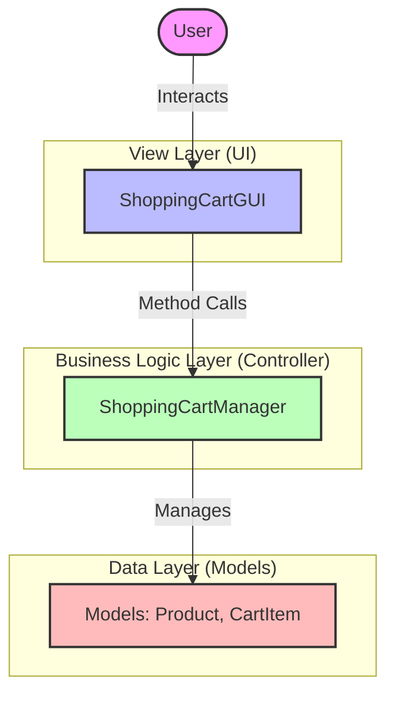
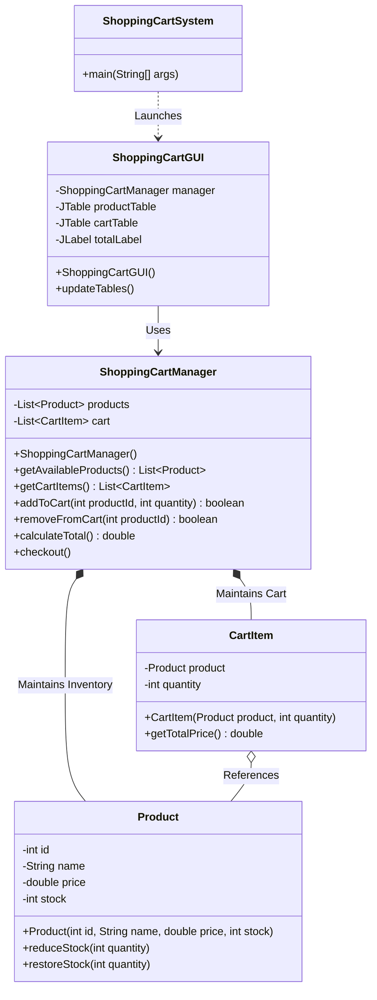
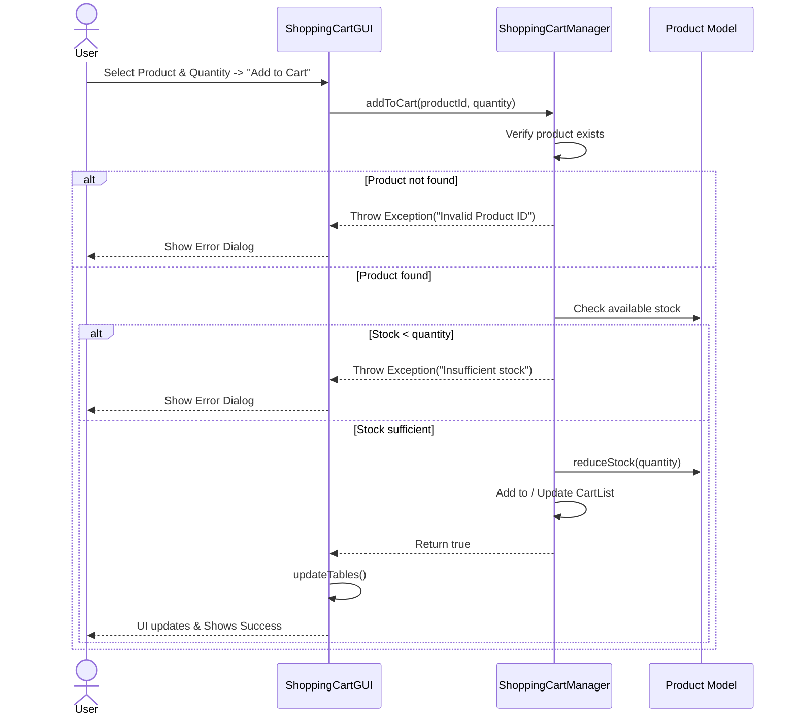
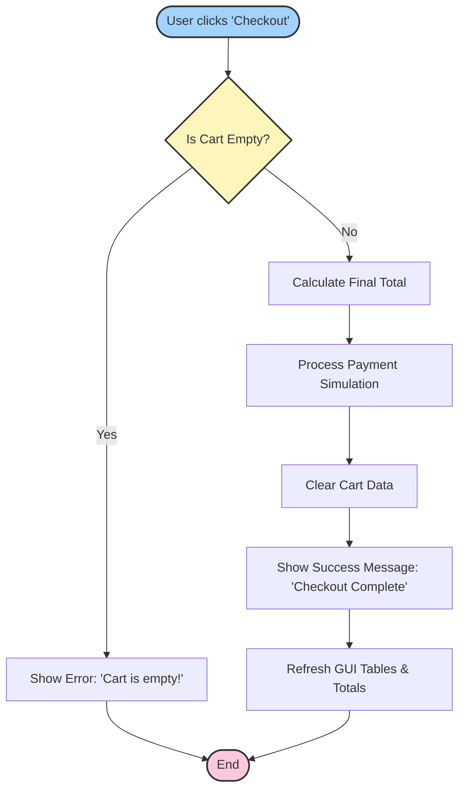

# 🛒 Smart Cart OS - Java Swing E-Commerce Application

Welcome to the **Smart Cart OS**! This is a robust, feature-rich desktop application built using Java and Java Swing. It simulates a modern shopping cart system with real-time stock management, interactive user interfaces, and modular architecture.

## 🌟 Key Features

- **Interactive GUI**: Built entirely with Java Swing, offering a clean, user-friendly interface with `JTable` components for seamless data viewing.
- **Real-Time Stock Management**: Products automatically update their available stock when added to or removed from the cart. 
- **Validation Mechanisms**: Built-in safeguards against over-ordering (insufficient stock) and negative quantities.
- **Cart Management**: Users can dynamically add items, remove them, and adjust quantities. The total price is calculated on the fly.
- **Modular Architecture**: Strictly follows the Model-View-Controller (MVC) pattern principles, separating the user interface from the underlying business logic.

---

## 🏗️ System Architecture

The application is structured into three main layers: the View (GUI), the Controller (Manager), and the Data Models. This ensures clean separation of concerns and maintainability.



---

## 🧩 Class Diagram

The following class diagram details the relationships between the core components of the Smart Cart OS.



---

## 🔄 User Flows & Logic

### 1. Adding an Item to the Cart

When a user attempts to add an item to their cart, several checks are performed to ensure data integrity and stock availability.



### 2. Checkout Process

The checkout flow is streamlined to ensure the cart isn't empty before finalizing the purchase.



---

## 🛠️ Technology Stack

- **Language**: Java 8+
- **UI Framework**: Java Swing (AWT/Swing components)
- **Design Pattern**: MVC (Model-View-Controller)
- **Architecture**: Monolithic Desktop Application

---

## 🚀 Setup & Installation

Follow these steps to run the application on your local machine.

### Prerequisites
- Ensure you have the **Java Development Kit (JDK)** installed (Version 8 or higher).
- An IDE (like IntelliJ IDEA, Eclipse, VS Code) or command-line interface.

### Running from Command Line

1. **Navigate to the Project Directory**:
   ```bash
   cd path/to/project
   ```

2. **Compile the Java Files**:
   ```bash
   javac *.java
   ```

3. **Run the Application**:
   ```bash
   java ShoppingCartSystem
   ```

### Running from an IDE
1. Open your preferred IDE.
2. Open the directory containing the project files.
3. Locate `ShoppingCartSystem.java`.
4. Right-click and select **Run 'ShoppingCartSystem.main()'**.

---

## 📖 Usage Guide

1. **Browse Products**: Upon launching, the left panel displays all available products, their prices, and current stock levels.
2. **Add to Cart**: 
   - Enter the Product ID and desired Quantity in the input fields at the bottom left.
   - Click **Add to Cart**.
   - If stock is sufficient, the item will appear in your Cart (right panel), and the product's stock will dynamically decrease.
3. **Remove from Cart**:
   - To remove an item, enter its Product ID in the input field on the bottom right.
   - Click **Remove from Cart**. 
   - The item will be deleted from the cart, and its stock will be restored in the inventory.
4. **Checkout**:
   - Once you are happy with your selections, click the **Checkout** button.
   - A summary of your total will be finalized, the cart will clear, and you will be ready for a new transaction.

---

## 🔮 Future Enhancements

- **Database Integration**: Migrate from in-memory arrays to a SQL database (e.g., MySQL, SQLite) for persistent inventory and user data.
- **User Authentication**: Add login/register functionality to save cart states across different sessions.
- **Receipt Generation**: Implement PDF generation to create downloadable invoices upon checkout.
- **Dynamic Theming**: Upgrade the UI with modern LookAndFeel libraries (like FlatLaf) to provide dark/light modes and contemporary aesthetics.
